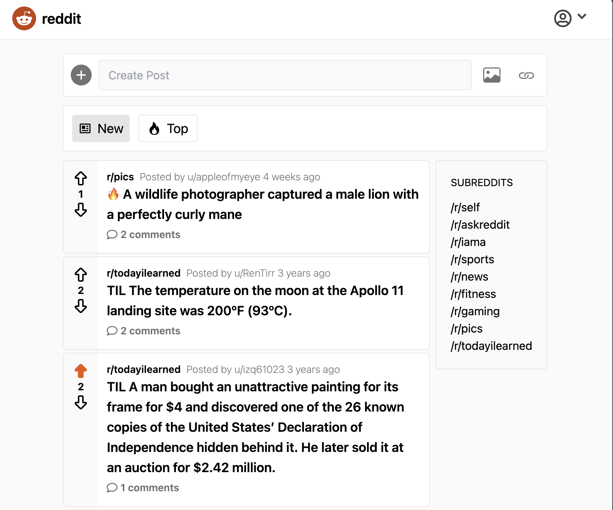

# Reddit Clone

A full-featured Reddit-style social platform with posts, user authentication, and threaded comments.



## 🚀 Live Demo

[View Live Site](https://reddit-clone-next-supabase.vercel.app/)

## ⚡ Features

- User authentication (sign up, login, logout)
- Create and manage posts
- Upvote/downvote system
- Threaded comments with replies
- Responsive mobile-first design

## 🛠️ Built With

- Next.js 14
- React
- TypeScript
- Supabase (PostgreSQL + Auth)
- Tailwind CSS

## 📦 Setup

```bash
npm install
npm run dev
```

## 🐳 Docker

```bash
docker build -t reddit-clone .
docker run -p 3000:3000 reddit-clone
```

## 🎯 Why I Built This

To demonstrate full-stack capabilities including authentication, database design, real-time features, and modern React patterns.
